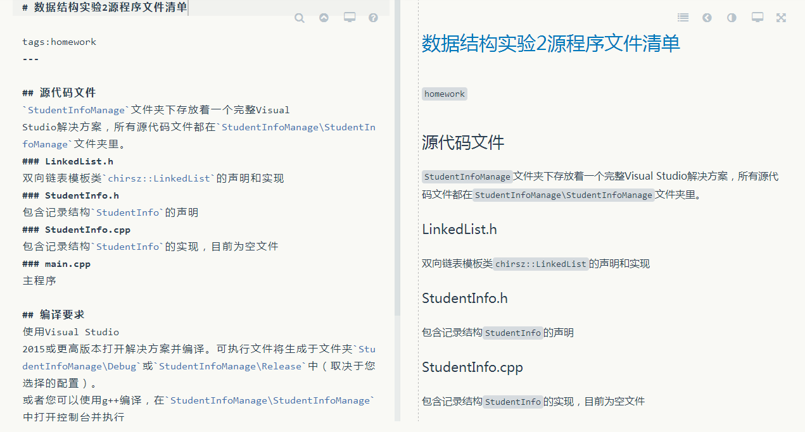
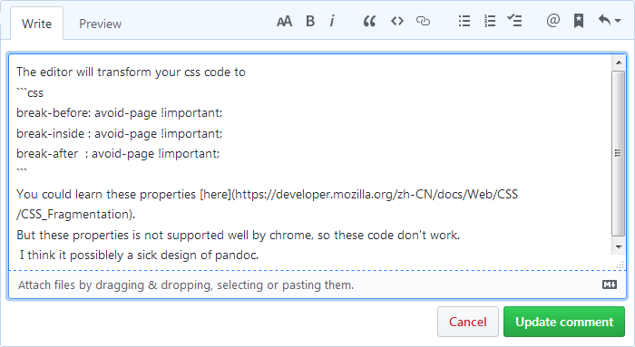
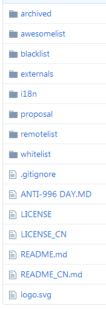
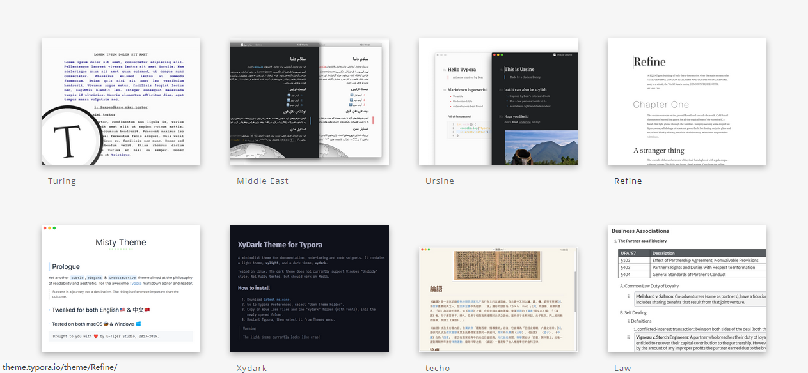

<div style="font: 26pt SimSun;text-align: center;white-space:pre-line">
武汉大学计算机学院
本科生课程设计报告
</div>


# CSS设计实践


<div style="font:15pt SimSun;white-space:pre;padding-left: 7em;">
专 业 名 称   ：XXX XXX
课 程 名 称   ：XXX XXX
指 导 教 师 一：XXX    职称
指 导 教 师 二：XXX    职称
学 生 学 号   ：20XXXXXXXXX
学 生 姓 名   ：XXX
</div>


<div style="font:18pt SimSun;text-align:center;">二○XX年X月</div>
<hr class="no-print" />
<div class="solemn-statement-title" style="font:bold 22pt SimSun;text-align: center;"> 郑重声明 </div>
<p class="solemn-statement-body" style="font: 14pt SimSun;">
本人呈交的设计报告，是在指导老师的指导下，独立进行实验工作所取得的成果，所有数据、图片资料真实可靠。尽我所知，除文中已经注明引用的内容外，本设计报告不包含他人享有著作权的内容。对本设计报告做出贡献的其他个人和集体，均已在文中以明确的方式标明。本设计报告的知识产权归属于培养单位。 
</p>


<div class="solemn-statement-signature" style="text-align: right;white-space: pre;font: 14pt SimSun;">本人签名：<u>               </u>        日期： <u>               </u></div>
<hr class="no-print" />
<div class="summary-title" style="font:bold 18pt SimHei;text-align: center;">摘&emsp;&emsp;要 </div>
本实验设计了一个作为Typora主题的CSS样式，可以帮助同学们更方便的进行课程设计报告的书写。同时提供了一份报告模板。


<span class="summary-keyword-title" style="font: 12pt SimHei;">关键词：</span>CSS；实验报告；前端开发；Typora

<hr class="no-print" />
<div class="toc-title" style="font:bold 18pt SimHei;text-align:center;">目&emsp;&emsp;录</div>
[TOC]

<hr class="no-print"></hr>
## 实验的目的和意义


### 实验目的

本实验希望使同学们摆脱书写实验报告时调整格式的痛苦，从而使大家能更多集中于实验报告内容和质量，而不是耗费大量时间于格式调整。


#### 目的一：减轻同学写作负担

在Word中自定义样式是比较复杂的操作。作为计算机专业文档中往往会出现大量代码，在Word中不好排版。Markdown中则可以很容易的插入代码块、行内代码块与公式、行内公式，还可以用Typora进行编辑、转换为Word文档或pdf文件。Markdown的文件格式也容易用Sublime Text、VSCode等编辑器打开编辑，可被git等代码管理软件以行为单位记录变动。

#### 目的二：进行CSS练习

CSS是层叠样式表 (Cascading Style Sheets)的简写，是前端开发的必修课；除了大一下学期的网页设计制作外我并没有接触CSS知识，也没有编写CSS代码的经验，所以希望通过这个项目使自己得到锻炼。

### 实验意义

其实我想不出来实验意义，但报告格式上要这么写，我就只能这么写。

## 实验设计

### Mardown简介

Markdown是一种可以使用普通文本编辑器编写的标记语言，通过简单的标记语法，它可以使普通文本内容具有一定的格式。

<figure>
  
  <figcaption>Markdown代码示例，使用Cmd Markdown编辑器</figcaption>
</figure>

Markdown具有一系列衍生版本，用于扩展Markdown的功能（如表格、脚注、内嵌HTML等等），这些功能原初的Markdown尚不具备，它们能让Markdown转换成更多的格式，例如$\rm\LaTeX$，Docbook。Markdown增强版中比较有名的有Markdown Extra、MultiMarkdown、 Maruku等。这些衍生版本要么基于工具，如Pandoc；要么基于网站，如GitHub和Wikipedia，在语法上基本兼容，但在一些语法和渲染效果上有改动。

<figure>
  
  <figcaption>Github的Markdown编辑器</figcaption>
</figure>

Markdown的语法简洁明了、学习容易，而且功能比纯文本更强，因此有很多人用它写博客。世界上最流行的博客平台WordPress和大型CMS如Joomla、Drupal都能很好的支持Markdown。完全采用Markdown编辑器的博客平台有Ghost和Typecho。

Markdown经常用于编写软件说明文档，并且以“README.md”的文件名保存在软件的目录下。

<figure>
  
  <figcaption>一个使用Markdown格式书写README文件的项目</figcaption>
</figure>


### Typora简介

Typora 是一款支持实时预览的 Markdown 文本编辑器。它有 OS X、Windows、Linux 三个平台的版本，并且由于仍在测试中，是完全免费的。

Typora的特色在于“所见即所得”，拥有类似Word的编辑方式，新用户很容易习惯和上手。

Typora是高度可定制化的，支持直接输入html代码和用CSS自定义主题。

<figure>
  
  <figcaption>Typora支持切换多种主题</figcaption>
</figure>

### 设计思路

#### Typora自定义主题简介

Typora做的主要工作就是把Markdown标记转换为HTML标记再渲染出来，比如`**强调**`就会被转换成`<strong>强调</strong>`。

<div class="table-caption">部分Markdown语法与HTML标记对照</div>
| Markdown语法 | HTML标记 |
| :----: | :----: |
|  \*\*strong\*\* | strong |
| \*em\* | em |
| \`inline-code\` | code |
| !\[\](img-src) | img |

所以Typora的编辑界面本质上就是一个浏览器，你甚至可以按<kbd>Ctrl</kbd>+<kbd>F12</kbd>来呼出浏览器的开发者工具。Typora允许自定义CSS样式，同时给出了标记转换的规范和主题编写教程，这样只要对照《武汉大学计算机学院本科生课程设计报告书写印制规范》（下简称“规范”）编写出对应的CSS代码就能够在Typora界面呈现出符合要求的样式，达到用Markdown写实验报告的目的。

#### 方案局限

在编写主题的过程中，我们遇到了很多困难，有的是能够克服或者绕过，或者通过某些工具能够达到的，比如一篇实验报告除了标题和正文，还有封面、摘要、声明、教师评价等成分，并不能由Markdown标记表达，还好Typora支持直接书写HTML代码。但是Typora的即时渲染策略是忽略`div`标记中的`class`和`id`属性，所以并不能在编辑时呈现上述成分的字体效果，只能把样式代码手动添加到相应元素的`style`属性中。

更多问题是当前无法克服的。通过CSS样式能够实现标题和图表的自动编号，但是规范示例中“参考文献”和“附录”是不带编号的，即使在正文里能使用一个前置div标记使其取消编号，在目录中却无法取消。

Typora通过Markdown标记``只生成`img`标记，而图标题和图序号需要`figure`标记，只能手动输入HTML标记来插入图片。自动生成的图序号中的“图”字也是粗体，和示例中“图”字为普通字重也不符合。所以我们提供了不进行自动编号的主题。

有些特性必须借助Prince软件才能解决，比如页面的页眉和页脚编号。由于Typora生成HTML文件时对我们写的CSS代码会有所修改，以及Typora生成的HTML代码不满足某些要求，在把导出的HTML文件提供给Prince前我们还需要用一个Python脚本处理一下。

Typora的表格是不带标题（caption）的，如果需要则需自己写带`caption`标签的HTML代码，或者在表前写`<div class="table-caption">表标题内容</div>`，前文所述脚本将会把它转换成表的标题。

## 实验成果

本PDF就是在WHU CS Report主题下写成，再导出HTML文件，脚本处理后用Prince转换的。

整个主题代码及报告模板发布在[github](https://github.com/chirsz-ever/whu-cs-report)上，同时本PDF附录中也有CSS主题的完整代码（主要是为了展示代码块效果）。

<div class="not-count-after"></div>
## 参考文献


<div class="not-count-after"></div>
## 附录

whu-cs-report.css

```css
@charset "utf-8";

.custom-css-head {}

html, body {
  margin: 0;
  padding: 0;
}

* {
  box-sizing: border-box;
  -moz-box-sizing: border-box;
}

#write {
  /* 正文：宋体 小四 */
  font: 12pt SimSun;
  text-align: justify;
  white-space: pre-wrap;
  text-indent: 0;
}

#write p {
  text-indent: 2em;
  line-height: 23pt;
  letter-spacing: normal;
}

#write span {
  text-indent: 0;
}

#write h1, #write h2, #write h3, #write h4, #write h5, #write h6 {
  color: #000;
  font-family: SimHei; /* 黑体 */
  font-weight: bold;
  text-indent: 0;
}

/* 总标题 */
#write h1 {
  font-size: 22pt; /* 黑体2号 */
  text-align: center;
  line-height: 32pt; /* 行间距32磅 */
}

/* 章标题 */
#write h2 {
  font-size: 18pt; /* 黑体小2号 */
  text-align: center;
  margin-top: 0.8em;
  margin-bottom: 0.5em;
}

#write h3 {
  font-size: 14pt; /* 黑体4号 */
  margin: 0.5em auto;
}

#write h4 {
  font-size: 12pt; /* 黑体小4号 */
}

#write h5 {
  font-size: 12pt; /* 黑体小4号 */
}

/* “郑重声明” 标题 */
.solemn-statement-title {
  font: 22pt SimSun;
  font-weight: bold;
  text-align: center;
}

/* “郑重声明” 正文 */
.solemn-statement-body {
  font: 14pt SimSun;
}

/* “郑重声明” 签名处 */
.solemn-statement-signature {
  text-align: right;
  white-space: pre;
  font: 14pt SimSun;
}

/* 摘要标题 */
.summary-title {
  font: 18pt SimHei;
  text-align: center;
}

/* 摘要关键字 */
.summary-keyword-title {
  font: 12pt SimHei;
}

/* “教师评语评分” 标题 */
.teacher-comment-title {
  font: 18pt SimSun;
  font-weight: bold;
  text-align: center;
}

/* “教师评语评分” 正文 */
.teacher-comment-body {
  font-size: 14pt;
  text-indent: 0;
}

/* “教师评语评分” 落款处 */
.teacher-comment-signature {
  font-size: 14pt;
  text-align: right;
  white-space: pre;
  line-height:2.5;
}

/* 目录 */
.toc-title {
  font:bold 18pt SimHei;
  text-align:center;
}

.md-toc-content {
  color: #000;
  font: 12pt SimSun;
  text-indent: 0;
}

.md-toc-h1, .md-toc-h4, .md-toc-h4, .md-toc-h5, .md-toc-h6 {
  display: none;
}

#write a.md-toc-inner {
  color: #000;
  margin: 0;
}

.md-toc-h2 .md-toc-inner {
  font: bold 14pt SimHei;
  text-align: left;
}

.md-toc-h3 .md-toc-inner {
  line-height: 1.5;
}

/* 目录页码 */
span.md-toc-item.md-toc-h2 a::after, span.md-toc-item.md-toc-h3 a::after { 
  content: " " leader('·') target-counter(attr(href), page) ; 
  font-family: "Times New Roman";
}

span.md-toc-item.md-toc-h2 a, span.md-toc-item.md-toc-h3 a{ 
  display: block;
}

#write figure {
  text-align: center;
}

/* 图标题 */
#write figure figcaption {
  text-align: center;
}

/* 表格 */

#write table {
  border-collapse: collapse;
  border-spacing: 0;
  font: 10.5pt SimSun;
}

#write table th, #write table td {
  padding: 0.5em 1em;
  font-family: "Times New Roman" ,SimSun;
  font-size: 10.5pt;
}

#write table .md-table-edit th {
  border: none;
  padding: 0;
  color: inherit;
}

#write table th, #write table td {
  border-left: 0;
  border-right: 0;
}

#write table th {
  border-top: 1.5pt solid;
  border-bottom: 0.5pt solid;
}

#write table tbody tr:last-of-type {
  border-bottom: 1.5pt solid;
}

/* 表格标题 */
#write table caption {
  text-align: center;
  font: 12pt SimHei;
}

/* 行内代码块 */
#write code {
  font-family: Consolas, Courier, 'Courier New', monospace;
  border: 1px solid;
  border-radius: 3px;
  border-color: cornflowerblue;
  background-color: aqua;
  padding: 0.5px 3px;
  word-break: break-all;
}

/* 自动编号 */

/** initialize css counter */
#write {counter-reset: h2}

#write h2 {
  counter-reset: h3 figurenum tablenum;
  counter-increment: h2;
}

#write h3 {
  counter-reset: h4;
  counter-increment: h3;
}

#write h4 {
  counter-reset: h5;
  counter-increment: h4;
}

#write h5 {
  counter-reset: h6;
  counter-increment: h5;
}

#write h6 {
  counter-increment: h6;
}

/** put counter result into headings */

#write h2::before {
    content: counter(h2) "\3000"
}

#write .not-count-after + h2::before {
    content: none;
}

#write h3::before,
h3.md-focus.md-heading::before {
  /** override the default style for focused headings */ 
  content: counter(h2) "." counter(h3) "\3000"
}

#write h4::before,
h4.md-focus.md-heading::before {
    content: counter(h2) "." counter(h3) "." counter(h4) "\3000"
}

#write h5::before,
h5.md-focus.md-heading::before {
    content: counter(h2) "." counter(h3) "." counter(h4) "." counter(h5) "\3000"
}

#write h6::before,
h6.md-focus.md-heading::before {
    content: counter(h2) "." counter(h3) "." counter(h4) "." counter(h5) "." counter(h6) "\3000"
}

/** override the default style for focused headings */
#write>h3.md-focus::before,
#write>h4.md-focus::before,
#write>h5.md-focus::before,
#write>h6.md-focus::before,
h3.md-focus::before,
h4.md-focus::before,
h5.md-focus::before,
h6.md-focus::before {
    color: inherit;
    border: inherit;
    border-radius: inherit;
    position: inherit;
    left:initial;
    float: none;
    top:initial;
    font-size: inherit;
    padding-left: inherit;
    padding-right: inherit;
    vertical-align: inherit;
    font-weight: inherit;
    line-height: inherit;
}

/* 目录项自动编号 */
.md-toc-content {
  counter-reset: h2toc
}
 
.md-toc-h2 {counter-reset: h3toc;}
 
.md-toc-h3 {counter-reset: h4toc;}

/* 目前无法做到目录项中参考文献和附录不显示编号 */
.md-toc-h2 a::before {
  color: #000;
  font: bold 14pt SimHei;
  counter-increment: h2toc;
  content: counter(h2toc) "\3000"
}
 
.md-toc-h3 a::before {
  color: #000;
  counter-increment: h3toc;
  content: counter(h2toc) "." counter(h3toc) "\3000"
}

/* 图标题自动编号 */
#write figure figcaption::before {
  counter-increment: figurenum; 
  content: "图" counter(h2) "." counter(figurenum) "\3000"; 
  font-family: "Times New Roman", SimSun;
  font-weight: bold;
}

/* 表标题自动编号 */
#write table caption::before {
  counter-increment: tablenum; 
  content: "表" counter(h2) "." counter(tablenum) "\3000"; 
  font-family: "Times New Roman", SimHei;
  font-weight: bold;
  font-size: 12pt;
}

/* 代码块 */
#write pre.md-fences {
  border: 1px solid black;
  padding-top: 10pt;
  padding-bottom: 10pt;
  break-inside: auto;
}
 
/* 在屏幕上仿Word显示 */
@media screen {
  html, body {
    background: #eee;
  }

  #write {
    /* 白色页面 */
    background: #fff;

    /* 页面为A4大小 */
    max-width: 210mm;
    min-height: 297mm;

    /* 页边距: 上   左右  下 */
    padding: 25mm 30mm 20mm;

    /* 上下留空 */
    margin: 1cm auto;

    /* 阴影 */
    box-shadow: 0 4px 5px rgba(75, 75, 75, 0.2);
  }
}

/***** 打印设置 *****/
@media print {
  html, body {
    background-color: #fff;
  }

  #write {
    width: initial !important;
    min-height: initial !important;
    margin: 0 !important;
    padding: 0 !important;
    border: initial !important;
    border-radius: initial !important;
    background: initial !important;
    box-shadow: initial !important;
  }

  /* 任意处强制分页：<div style="page-break-after: always" ></div> */
  /* 或者 <hr class="page-break" ></hr> 以在编辑时可见*/
  #write .page-break {
    visibility: hidden;
    break-after: page;
  }

  #write .no-print {
    display: none;
  }
}

.md-toc {
  break-after: page;
}

/* 各章标题，中文摘要、结论、参考文献标题，目录标题前必须分页 */
#write h2, .solemn-statement-title, .summary-title, .teacher-comment-title, .toc-title{
  break-before: page;
}

/* 各级标题后不允许分页 */
#write h1, h2, h3, h4, h5, h6 {
  page-break-after: avoid;
}

/* 图和图序号、图标题中不得分页，表格也是如此 */
#write figure {
  page-break-inside: avoid;
}

#write h1 {
  string-set: doctitle content();
}

@page {
  size: A4 portrait;
  margin: 25mm 30mm 20mm;

  /* 页码 */
  @bottom-center {
    content: counter(page);
    font: 10.5pt "Times new roman";
  }

  @top-center {
    content: string(doctitle);
    font: 10.5pt SimSun;
  }
}

.pre-content {
  page: pre-content;
}

@page:nth(1) {
  @bottom-center {
    content: none;
  }
}

@page:nth(2) {
  @bottom-center {
    content: none;
  }
}

@page:nth(3) {
  @bottom-center {
    content: none;
  }
}

@page toc-pages {
  @bottom-center {
    content: none;
  }
}

.toc-title, .md-toc {
  page: toc-pages;
}

#write h2:first-of-type {
  counter-reset: page 1;
}


```


<hr class="no-print">
<div class="teacher-comment-title" style="font:bold 18pt SimSun;text-align: center;">教师评语评分</div>


<div class="teacher-comment-body" style="font-size: 14pt;text-indent: 0">
评语：
</div>


<div class="teacher-comment-signature" style="font-size: 14pt;text-align: right;white-space: pre;line-height:2.5;">
评  分：                     
评阅人：                     
年     月     日
</div>

<div class="teacher-comment-body" style="font-size: 14pt;text-indent: 0;" >（备注：对该实验报告给予优点和不足的评价，并给出百分制评分。）</div>
